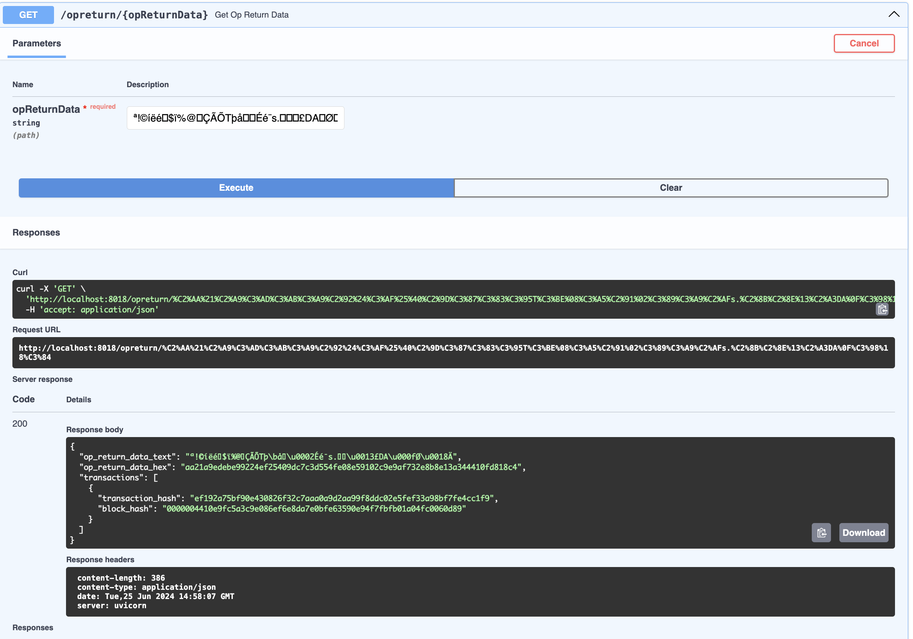

# Code Challenge

## Introduction

This code Challenge is fun and to test your basic understanding of software coding and bitcoin-related knowledge.

## Project Structure
- /backend: contains a python fastapi server that can receive api call and grab data from the database
- /docker: include the docker-compose file for setting servies up
- /listener: written in python, this app contiously grab data via bitcoin core's rpc, store into the database

## Software needed
- Docker & Docker-compose
- Bitcoin-core
- DBeaver (optional) 


## Environment set up

### Docker & Docker-compose
The local code are tested under docker==24.0.6, docker-compose==v2.23.0-desktop.1, mac m2 chip. New version of docker has already depreciated docker-compose, plz refer to the offical doc if you are using a newer version.

### Bitcoin-core
Plz download the latest bitcoin-core from the offical website. After installation, you need to do scrnization as well as modifing the config file.

The bitcoin.conf is located at ~/Library/Application Support/Bitcoin/ on Mac. Path varies for different OS. If you cannot find this file in this directory, create a new one.

The values inside the file:
```bash
signet=1
server=1
rpcuser=mud
rpcpassword=123456
txindex=1
```
You can modify the auth values if you want, just ensure to change the envs defined in the docker-compose file to match the changes.

### DBeaver (optional)
In order to better interact with the mySQL database, a interface tool is recommended.

## Local build

Go to the docker folder, run the cmd (if having same docker version):
```bash
docker-compose up --build
```

A container logs viewer will be available at localhost:9999

Database could be connected via jdbc:mysql://localhost:8090/db on DBeaver using username=user, password=password.

For first-time usage, since the database tables not created, you will have to use this SQL script to manually create these tables:
```sql
CREATE DATABASE IF NOT EXISTS db;
USE db;

-- Drop existing tables if they exist, in reverse order of dependency
DROP TABLE IF EXISTS transaction_op_return;
DROP TABLE IF EXISTS op_return_data;
DROP TABLE IF EXISTS transactions;
DROP TABLE IF EXISTS blocks;

-- Create blocks table
CREATE TABLE blocks (
    id VARCHAR(36) PRIMARY KEY,
    block_hash VARCHAR(64) NOT NULL UNIQUE,
    block_height INT NOT NULL,
    timestamp DATETIME NOT NULL
);

-- Create transactions table
CREATE TABLE transactions (
    id VARCHAR(36) PRIMARY KEY,
    tx_hash VARCHAR(64) NOT NULL UNIQUE,
    block_id VARCHAR(36),
    FOREIGN KEY (block_id) REFERENCES blocks(id) ON DELETE CASCADE
);

-- Create op_return_data table
CREATE TABLE op_return_data (
    id VARCHAR(36) PRIMARY KEY,
    op_return_data VARCHAR(255) NOT NULL,
    INDEX (op_return_data)
);

-- Create transaction_op_return table
CREATE TABLE transaction_op_return (
    transaction_id VARCHAR(36),
    op_return_id VARCHAR(36),
    PRIMARY KEY (transaction_id, op_return_id),
    FOREIGN KEY (transaction_id) REFERENCES transactions(id) ON DELETE CASCADE,
    FOREIGN KEY (op_return_id) REFERENCES op_return_data(id) ON DELETE CASCADE
);
```

## Backend API testing
Backend API testing can be accessed via http://localhost:8018/docs when service is up.

A successful API test call will look like this:

<figure style="text-align:center">
  
</figure>
